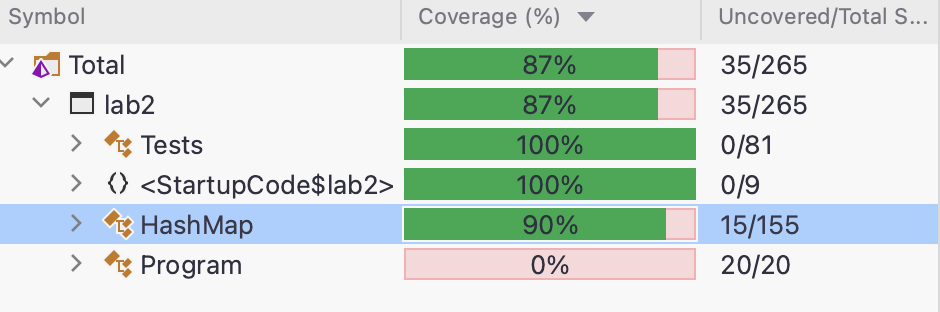

# Функциональное программирование
## Лабораторная работа 2
### Вариант HashMap (OpenAdressing)
**Выполнил:** Лыщев Иван Антонович \
**Группа:** P34112 \
**Преподаватель:** Пенской Александр Владимирович

### Требования к стуктуре
>Функции:
>- добавление и удаление элементов;
>- фильтрация;
>- отображение (map);
>- свертки (левая и правая);
>- структура должна быть моноидом.

> Требования к библиотеке
>- Структуры данных должны быть неизменяемыми.\
>- Библиотека должна быть протестирована в рамках unit testing.\
>- Библиотека должна быть протестирована в рамках property-based тестирования (как минимум 3 свойства, включая свойства монойда).\
>- Структура должна быть полиморфной.\
>- Требуется использовать идиоматичный для технологии стиль программирования.

>Разрешение коллизий Open Address \
> При совпадении результатов hash-функции выбирается другая пустая ячейка\
> В моей реализации выбирается следующая ячейка

### Реализация
Сама структура является массивом узлов. Каждый узел хранит в себе пару ключ-значение и признак удаления.\
При этом в F# для реализации записи пустых элементов требуется оборачивать узел в структуру Option. 
```f#
type node<'K, 'V> =
    struct
        val key: 'K
        val value: 'V
        val isDeleted: bool

        new(_key: 'K, _value: 'V, _isDeleted: bool) =
            { key = _key
              value = _value
              isDeleted = _isDeleted }

        new(_key: 'K, _value: 'V) =
            { key = _key
              value = _value
              isDeleted = false }
    end
    
type hashMap<'K, 'V> = Option<node<'K, 'V>>[]
```
Для создания HashMap создается массив длины n из элементов Option.None т.е. пустых 
```f#
let create<'K, 'V> (count: int): hashMap<'K, 'V> = Array.create count Option.None
```
При добавлении элементов исходный массив дублируется для неизменяемости исходного
```f#
let add (key: 'K, v : 'V) (hashTable: hashMap<'K, 'V>) =
    let innerMap = Array.copy hashTable
    addRec (getIndex (hash key) innerMap) (key, v) innerMap
```
Функция addRec итеративно ищет подходящую ячейку. Она должла быть либо пустой, либо с флагом isDeleted = true, либо с совпадающим ключем.
```f#
let rec private addRec (i: int) (key: 'K, v: 'V) (hashTable: HashMap<'K, 'V>) =
    let size = hashTable.Length

    if (i < size) then
        match hashTable[i] with
        | Some nd when nd.isDeleted || ((not nd.isDeleted) && (nd.key = key)) ->
            hashTable[i] <-Option.Some(Node (key, v))
            hashTable
        | Some nd when (not nd.isDeleted) && (nd.key <> key) ->  addRec (getNext i) (key, v) hashTable
        | _ ->
            hashTable[i] <- Option.Some(Node (key, v))
            hashTable
    else
        let newHM = resize hashTable
        addRec (getIndex (hash key) newHM) (key, v) newHM
and resize (hashMap: hashMap<'K, 'V>) : hashMap<'K, 'V> = ...
```
Когда индекс массива выходит за границы размера, то создается новый массив с размером в два раза больше. Все элементы переносятся в него и добавляется требуемый 
```f#
and resize (hashMap: HashMap<'K, 'V>) : HashMap<'K, 'V> =
    let size = getLength hashMap
    let newHashMap = create<'K, 'V> (size * 2)

    let rec transfer i (hMap: HashMap<'K, 'V>) : HashMap<'K, 'V> =
        if i < size then
            match hashMap[i] with
            | Some nd -> transfer (i + 1) (addRec (getIndex (hash nd.key) hMap) (nd.key, nd.value) hMap)
            | _ -> transfer (i + 1) hMap
        else
            hMap

    transfer 0 newHashMap
```
Удаление осуществляется поиском нужного индекса по ключу и узел либо помечается удаленным, либо isDeleted
```f#
let delete (key: 'K) (hashMap: HashMap<'K, 'V>) =
    let innerHM = Array.copy hashMap
    let ndOption = get key innerHM
    match ndOption with
    | Some ndOption -> markAsDeleted ndOption innerHM
    | _ -> innerHM
```
Функция поиска индекса возвращает -1, если элемент не найден
```f#
let rec private findIndexByKeyRec i (key: 'K) (hashMap: HashMap<'K, 'V>) =
    let size = getLength hashMap
    if i < size then
        match hashMap[i]  with
        | Some nd when ( not nd.isDeleted) && (nd.key <> key) -> findIndexByKeyRec (getNext i) key hashMap
        | Some nd when ( not nd.isDeleted ) && (nd.key = key) -> i
        | _ -> -1
    else
        -1
```
В зависимости от того, последний у нас элемент или нет, он помечается Deleted или присваивается None
```f#
let public markAsDeleted (deleteNd: Node<'K, 'V>) (hashMap: HashMap<'K, 'V>) : HashMap<'K, 'V> =
    let size = hashMap.Length
    let ndOption = get deleteNd.key hashMap

    if ndOption.IsSome then
        let nd = ndOption.Value
        let i = findIndexByKey nd.key hashMap

        if i = (size - 1) then
            hashMap[i] <- Option.None
        else
            hashMap[i] <- Option.Some(Node<'K, 'V>(deleteNd.key, deleteNd.value, true))

    hashMap
```
Функция фильтрации проходится по всем элементам и если они не None и функция возвращает false, то узел помечается deleted
```f#
let filter (f: Node<'K, 'V> -> bool) (hashMap: HashMap<'K, 'V>) =
    let innerMap = Array.copy hashMap

    let rec doFilter (hm: HashMap<'K, 'V>) : HashMap<'K, 'V> =
        let size = hm.Length

        match hm |> Array.truncate 1 with
        | [| ndOption |] when ndOption.IsSome ->
            let nd = ndOption.Value

            if not (f nd) then
                innerMap |> markAsDeleted nd |> ignore

            doFilter hm[1..size]
        | [| ndOption |] when ndOption.IsNone -> doFilter hm[1..size]
        | _ -> innerMap

    doFilter innerMap
```
Функция map проходится по всем элементам и если они не None, то узел добаляется к результирующему массиву со значение функции

```f#
let map (f: 'K -> 'V -> 'U) (hashMap: HashMap<'K, 'V>) =
    let size = hashMap.Length
    let innerMap = create<'K, 'U> size

    let rec mapRec i =
        match i with
        | 0 -> innerMap
        | _ ->
            match hashMap[i] with
            | Some nd ->
                innerMap[i] <- Option.Some(Node(nd.key, f nd.key nd.value, nd.isDeleted))
                mapRec (i - 1)
            | _ -> mapRec (i - 1)

    mapRec (size - 1)
```
Функция Fold проходится по всем элементам, если они не None или Deleted, то высчитывается state с помощью передаваемой функции и переходится к следующему элементу.
```f#
let fold (f: 'T -> 'K -> 'V -> 'T) (init: 'T) (hashMap: HashMap<'K, 'V>) : 'T =
    let rec foldRec i res =
        if i < getLength hashMap then
            match hashMap[i] with
            | Some nd when not nd.isDeleted -> foldRec (i + 1) (f res nd.key nd.value)
            | _ -> foldRec (i + 1) res
        else
            res

    foldRec 0 init
```
Функция backFold делает тоже самое, но начиная с конца
```f#
let backFold (f: 'T -> 'K -> 'V -> 'T) (init: 'T) (hashMap: HashMap<'K, 'V>) : 'T =
    let size = hashMap.Length

    let rec foldRec i res =
        if i >= 0 then
            match hashMap[i] with
            | Some nd when not nd.isDeleted -> foldRec (i - 1) (f res nd.key nd.value)
            | _ -> foldRec (i - 1) res
        else
            res

    foldRec (size - 1) init
```
Функция Merge служит для слияния двух HashMap. Создается массив с размером наибольшей передаваемой HashMap и туда сначала добавляются элементы из первого HashMap, потом из другой 
```f#
let merge (hashMap1: HashMap<'K, 'V>) (hashMap2: HashMap<'K, 'V>) : HashMap<'K, 'V> =
    if (getSize hashMap1 = 0) then
        hashMap2
    elif (getSize hashMap2 = 0) then
        hashMap1
    else
        let initSize = max (getLength hashMap1) (getLength hashMap2)
        let sumHm = create initSize

        let rec iterOverHM i (hm: HashMap<'K, 'V>) (resHm: HashMap<'K, 'V>) =
            if i >= 0 then
                match hm[i] with
                | Some nd when not nd.isDeleted -> add (nd.key, nd.value) resHm |> iterOverHM (i - 1) hm
                | Some nd when nd.isDeleted -> iterOverHM (i - 1) hm resHm
                | _ -> iterOverHM (i - 1) hm resHm
            else
                resHm

        sumHm
        |> iterOverHM (getLength hashMap1 - 1) hashMap1
        |> iterOverHM (getLength hashMap2 - 1) hashMap2
```
### Тесты
В каждом тесте, кроме PBT, используются начальные значения, которые создаются функцией initHm
```f#
let initHm =
    let hashTable: hashMap<int, int> =
        create 4
        |> add (0, 1)
        |> add (1, -1)
        |> add (3, 4)
        |> add (0, 3)
        |> add (5, 5)
        |> add (-1, 6)
        |> add (-1, 4)

    hashTable
```
**Проверка увеличения размера массива.** Когда мы добавляем элемент с ключем size, он помещается в конец. Также с ключем -1.
Соответственно когда добавляется с ключем -1, он упирается в размер массива и требуется увеличение. 
```f#
[<Theory>]
[<InlineData(4)>]
[<InlineData(40)>]
[<InlineData(12)>]
[<InlineData(7)>]
let ``test resize`` n =
    let hm = create n
    let init_size = hm |> getSize
    let size = hm |> add (init_size - 1,6)  |> getSize
    let size2 = hm |> add (init_size - 1,6) |> add (-1,10) |> getSize
    Assert.Equal(size * 2, size2)
```
**Проверка удаления.** Элемент удаляется и потом проверяется, возвращает ли поиск индекса -1
```f#
[<Theory>]
[<InlineData(0)>]
[<InlineData(1)>]
[<InlineData(-1)>]
[<InlineData(5)>]
let ``test delete`` key =
    let hm = initHm |> delete key
    Assert.False(hasKey key hm)
```
**Проверка фильтра.** Отсеиваются все значения с value. Потом проверятся, существует ли такой элемент
```f#
[<Theory>]
[<InlineData(1, -1)>]
[<InlineData(0, 3)>]
[<InlineData(-1, 4)>]
[<InlineData(5, 5)>]
let ``test filter`` key value =
    let hm = initHm |> filter (fun n -> (n.value <> value))
    Assert.False(hasKey key hm)
```
**Проверка свойства map.** Применяется функция приводящая value к string и проверяется тип резуьтирующей HashMap 
```f#
[<Property>]
let ``test map property`` (data: (int * int) list) =
    let hm = init 4 data |> map (fun k v -> $"{k} {v}") |> box
    hm :? hashMap<int, string>
```
**Проверка fold.** Проверяются результаты некоторых функций для тестовой HashMap
```f#
[<Fact>]
let ``test fold`` () =
    let hm = initHm 
    Assert.Equal(15, fold (fun state k v -> state + v) 0 hm)
    Assert.Equal(-15, fold (fun state k v -> state - v) 0 hm)
    Assert.Equal(-240, fold (fun state k v -> state * v) 1 hm)
```
**Проверка backFold.** Аналогично fold.
```f#
[<Fact>]
let ``test fold`` () =
    let hm = initHm 
    Assert.Equal(15, fold (fun state k v -> state + v) 0 hm)
    Assert.Equal(-15, fold (fun state k v -> state - v) 0 hm)
    Assert.Equal(-240, fold (fun state k v -> state * v) 1 hm)
```
**Проверка свойства add.** Проверяется, добавилось ли значение и правильное ли оно при получении.
```f#
[<Property>]
let ``test property add`` (node: (int * int), data: (int * int) list) =
    let hm = init 2 data
    let (k, v) = node
    let addedValue = hm |> add node |> get k |> Option.get
    addedValue = v
```
**Проверка нейтрального элемента.** Нейтральным элементом является пустая HashMap. Соответственно после слияния с другой HashMap сравнение должно вернуть true 
```f#
[<Property>]
let ``test property neutral element`` (data: (int * int) list) =
    let hm = init 4 data
    let neutral = create 1
    let sumHmHash = merge hm neutral
    compare sumHmHash hm
```
**Проверка ассоциативности** 
```f#
[<Property>]
let ``test associativity`` (data1: (int * int) list, data2: (int * int) list, data3: (int * int) list) =
    let hm1 = init 2 data1
    let hm2 = init 2 data2
    let hm3 = init 2 data3
    let merge12 = merge hm1 hm2
    let merge23 = merge hm2 hm3
    compare (merge merge12 hm3) (merge hm1 merge23))
```
### Покрытие тестов 
 

### Выводы
В ходе выполнения лабораторной работы я столкнулся с парой проблем. 
Первая связана с невозможностью присвоения null воощбе ни к чему. Потом я пытался использовать структуру Nullable, но оказалось, что она работает только как "обертка" классов.
Только потом я узнал об Option. ~~Также столкнулся с тем, что 2 функции addRec и resize переиспользуют логику друг друга и чтобы это реализовать пришлось "прокидывать" функцию addRec в resize. 
Мне это кажется плохим решением, но других способов я не нашел.~~\
**Update:** Eсли функция рекурсивная, то объявить одну внутреннюю функцию можно после с помощью
конструкции "*let rec ... and ...*"
